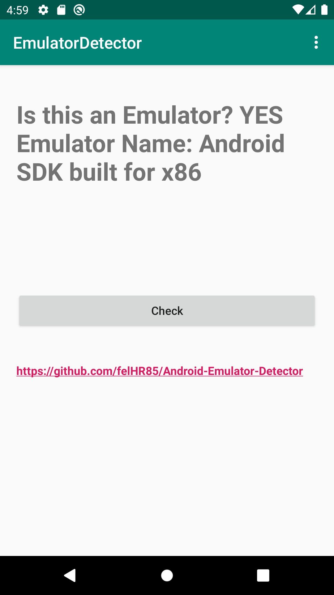

# Android-Emulator-Detector
App that detects if is running on an emulated environment(Also identifies what emulator is running ie BlueStacks, Nox Player, Genymotion...)\
[Download](https://github.com/felHR85/Android-Emulator-Detector/releases/download/1.0/app-release.apk)

